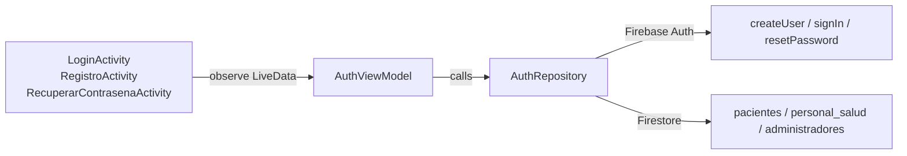
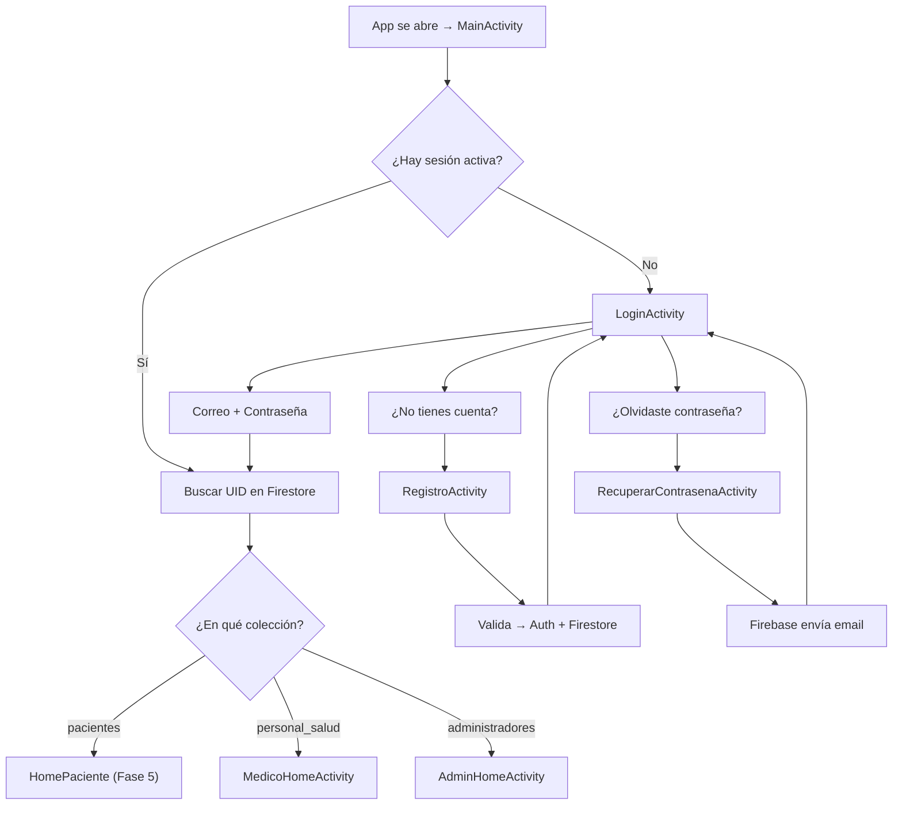
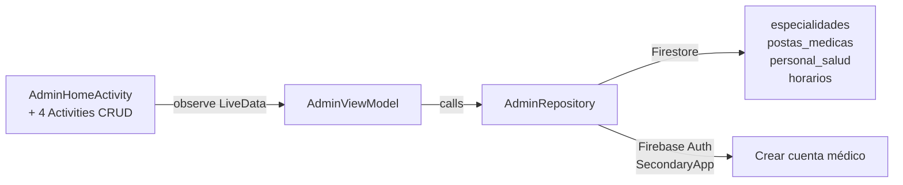
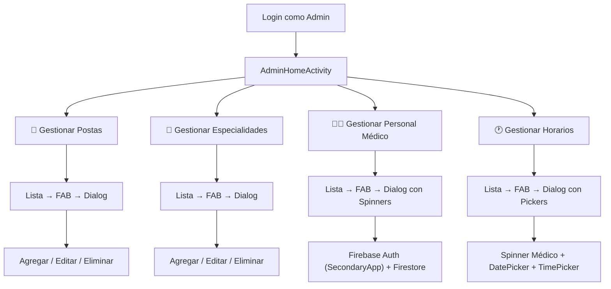

# MEDICITAS — Walkthrough Fases 1, 2 y 3

---

## Fase 1: Estructura del Proyecto y Modelos de Datos

### Objetivo
Configurar la base del proyecto Android con arquitectura MVVM, modelos de datos (Data Classes) para Firestore, y utilidades compartidas.

### Estructura de Paquetes

```
com.ayacucho.medicitas/
├── model/          ← Data Classes (8 entidades)
├── repository/     ← Acceso a datos (Firebase)
├── view/
│   ├── auth/       ← Login, Registro, Recuperar Contraseña
│   ├── admin/      ← Panel del administrador
│   ├── doctor/     ← Panel del médico
│   └── patient/    ← Panel del paciente
├── viewmodel/      ← Lógica de negocio (MVVM)
├── utils/          ← Constantes y utilidades
└── MainActivity.kt ← Splash/Router
```

### Modelos de Datos (8 Data Classes)

| Archivo | Entidad | Campos Principales |
|---------|---------|-------------------|
| [Paciente.kt](file:///c:/Users/LOQ/AndroidStudioProjects/MEDICITAS/app/src/main/java/com/ayacucho/medicitas/model/Paciente.kt) | Paciente | idPaciente, nombres, apellidos, dni, telefono, correo, fechaRegistro, rol |
| [PersonalSalud.kt](file:///c:/Users/LOQ/AndroidStudioProjects/MEDICITAS/app/src/main/java/com/ayacucho/medicitas/model/PersonalSalud.kt) | Médico | idPersonal, nombres, apellidos, dni, correo, idEspecialidad, idPosta, nombreEspecialidad*, nombrePosta* |
| [Administrador.kt](file:///c:/Users/LOQ/AndroidStudioProjects/MEDICITAS/app/src/main/java/com/ayacucho/medicitas/model/Administrador.kt) | Admin | idAdministrador, nombres, apellidos, correo, rol |
| [PostaMedica.kt](file:///c:/Users/LOQ/AndroidStudioProjects/MEDICITAS/app/src/main/java/com/ayacucho/medicitas/model/PostaMedica.kt) | Posta | idPosta, nombre, direccion, distrito, telefono, estado |
| [Especialidad.kt](file:///c:/Users/LOQ/AndroidStudioProjects/MEDICITAS/app/src/main/java/com/ayacucho/medicitas/model/Especialidad.kt) | Especialidad | idEspecialidad, nombre, descripcion, estado |
| [Horario.kt](file:///c:/Users/LOQ/AndroidStudioProjects/MEDICITAS/app/src/main/java/com/ayacucho/medicitas/model/Horario.kt) | Horario | idHorario, fecha, dia, horaInicio, horaFin, cuposDisponibles, cuposTotales, estado, idPersonal, idPosta |
| [CitaMedica.kt](file:///c:/Users/LOQ/AndroidStudioProjects/MEDICITAS/app/src/main/java/com/ayacucho/medicitas/model/CitaMedica.kt) | Cita | idCita, fecha, hora, estadoCita, motivoConsulta, idPaciente, nombrePaciente*, dniPaciente*, idPersonal, nombreMedico*, idPosta, nombrePosta*, idEspecialidad, nombreEspecialidad* |
| [Notificacion.kt](file:///c:/Users/LOQ/AndroidStudioProjects/MEDICITAS/app/src/main/java/com/ayacucho/medicitas/model/Notificacion.kt) | Notificación | idNotificacion, titulo, mensaje, tipo, estadoLectura, idUsuario, fechaEnvio |

> *Campos desnormalizados para evitar lecturas adicionales a Firestore.*

### Utilidades

| Archivo | Contenido |
|---------|-----------|
| [Constants.kt](file:///c:/Users/LOQ/AndroidStudioProjects/MEDICITAS/app/src/main/java/com/ayacucho/medicitas/utils/Constants.kt) | Nombres de colecciones, roles (Paciente/Medico/Admin), estados de cita (Reservada/Cancelada/Atendida/No Asistio), estados de horario (Disponible/Bloqueado), formatos de fecha |
| [Helpers.kt](file:///c:/Users/LOQ/AndroidStudioProjects/MEDICITAS/app/src/main/java/com/ayacucho/medicitas/utils/Helpers.kt) | `DateUtils` (fechaActual, horaActual), `ValidationUtils` (validarDni, validarCorreo, validarTelefono, validarContrasena) |

### Configuración Gradle

| Archivo | Detalle |
|---------|---------|
| [build.gradle.kts (app)](file:///c:/Users/LOQ/AndroidStudioProjects/MEDICITAS/app/build.gradle.kts) | AGP 9.1.0, minSdk 26, targetSdk 36, Firebase BOM 34.11.0 |
| [libs.versions.toml](file:///c:/Users/LOQ/AndroidStudioProjects/MEDICITAS/gradle/libs.versions.toml) | Catálogo de versiones |

### Dependencias Firebase
```kotlin
implementation(platform("com.google.firebase:firebase-bom:34.11.0"))
implementation("com.google.firebase:firebase-analytics")
implementation("com.google.firebase:firebase-auth")
implementation("com.google.firebase:firebase-firestore")
implementation("com.google.firebase:firebase-messaging")
```

> [!IMPORTANT]
> Se usan las variantes **sin** `-ktx` porque Firebase BOM 34.x ya incluye las extensiones Kotlin directamente.

### Decisiones de Diseño
- **Desnormalización**: Campos extra en `CitaMedica` y `PersonalSalud` para optimizar consultas
- **Validaciones**: DNI (8 dígitos), teléfono (9 dígitos), locale peruano
- **Seguridad**: Contraseña NO se guarda en Firestore (delegada a Firebase Auth)
- **Todos los Data Class** tienen valores por defecto `""` para compatibilidad con Firestore `toObjects()`

---

## Fase 2: Módulo de Autenticación

### Objetivo
Implementar login, registro de pacientes, recuperación de contraseña y enrutamiento por rol usando Firebase Auth + Firestore.

### Arquitectura MVVM



### Archivos Creados

#### Capa Repository
| Archivo | RFs Implementados |
|---------|-------------------|
| [AuthRepository.kt](file:///c:/Users/LOQ/AndroidStudioProjects/MEDICITAS/app/src/main/java/com/ayacucho/medicitas/repository/AuthRepository.kt) | RF01.1-RF01.8 |

**Funciones principales:**
- `registrarPaciente()` — Valida DNI único en Firestore → crea Auth → guarda en colección `pacientes`
- `iniciarSesion()` — Auth login → `determinarRolYRedirigir()`
- `determinarRolYRedirigir()` — Busca UID en: pacientes → personal_salud → administradores
- `recuperarContrasena()` — `sendPasswordResetEmail()`
- `cerrarSesion()` / `haySesionActiva()` / `obtenerUsuarioActual()`

#### Capa ViewModel
| Archivo | Funcionalidad |
|---------|---------------|
| [AuthViewModel.kt](file:///c:/Users/LOQ/AndroidStudioProjects/MEDICITAS/app/src/main/java/com/ayacucho/medicitas/viewmodel/AuthViewModel.kt) | Validaciones de formulario + LiveData para isLoading, errorMessage, navegarPaciente/Medico/Admin, registroExitoso, recuperacionExitosa |

#### Capa View (Activities)
| Archivo | Pantalla | RFs |
|---------|----------|-----|
| [LoginActivity.kt](file:///c:/Users/LOQ/AndroidStudioProjects/MEDICITAS/app/src/main/java/com/ayacucho/medicitas/view/auth/LoginActivity.kt) | Correo + Contraseña → Login → Ruta por rol | RF01.3, RF01.7 |
| [RegistroActivity.kt](file:///c:/Users/LOQ/AndroidStudioProjects/MEDICITAS/app/src/main/java/com/ayacucho/medicitas/view/auth/RegistroActivity.kt) | Formulario completo (Nombres, Apellidos, DNI, Teléfono, Correo, Contraseña, Confirmar) → crea Paciente | RF01.1, RF01.2, RF01.8 |
| [RecuperarContrasenaActivity.kt](file:///c:/Users/LOQ/AndroidStudioProjects/MEDICITAS/app/src/main/java/com/ayacucho/medicitas/view/auth/RecuperarContrasenaActivity.kt) | Correo → envía link de recuperación | RF01.4 |
| [MainActivity.kt](file:///c:/Users/LOQ/AndroidStudioProjects/MEDICITAS/app/src/main/java/com/ayacucho/medicitas/MainActivity.kt) | Splash/Router: si hay sesión → detecta rol → redirige; si no → Login | RF01.5, RF01.7 |

#### Layouts XML
| Archivo | Diseño |
|---------|--------|
| [activity_login.xml](file:///c:/Users/LOQ/AndroidStudioProjects/MEDICITAS/app/src/main/res/layout/activity_login.xml) | Header gradiente + TextInputLayout (correo, contraseña) + MaterialButton + links |
| [activity_registro.xml](file:///c:/Users/LOQ/AndroidStudioProjects/MEDICITAS/app/src/main/res/layout/activity_registro.xml) | Header gradiente + 7 campos de formulario + botón registrar |
| [activity_recuperar_contrasena.xml](file:///c:/Users/LOQ/AndroidStudioProjects/MEDICITAS/app/src/main/res/layout/activity_recuperar_contrasena.xml) | Header gradiente + campo correo + botón enviar enlace |

#### Recursos
| Archivo | Contenido |
|---------|-----------|
| [colors.xml](file:///c:/Users/LOQ/AndroidStudioProjects/MEDICITAS/app/src/main/res/values/colors.xml) | Paleta médica: primary (#1565C0), accent (#00BFA5), error, success, warning |
| [strings.xml](file:///c:/Users/LOQ/AndroidStudioProjects/MEDICITAS/app/src/main/res/values/strings.xml) | Todos los textos en español |
| [bg_gradient_primary.xml](file:///c:/Users/LOQ/AndroidStudioProjects/MEDICITAS/app/src/main/res/drawable/bg_gradient_primary.xml) | Gradiente azul 135° para headers |
| [bg_card_top_rounded.xml](file:///c:/Users/LOQ/AndroidStudioProjects/MEDICITAS/app/src/main/res/drawable/bg_card_top_rounded.xml) | Card con esquinas superiores redondeadas (32dp) |
| [bg_button_primary.xml](file:///c:/Users/LOQ/AndroidStudioProjects/MEDICITAS/app/src/main/res/drawable/bg_button_primary.xml) | Botón con bordes redondeados (12dp) |

### Flujo de Autenticación



### Configuración Requerida en Firebase Console

1. **Authentication** → Habilitar proveedor **Correo electrónico/Contraseña**
2. **Firestore Database** → Crear base de datos en **modo test**
3. Verificar que `google-services.json` esté en la carpeta `app/`
4. Crear el primer **Administrador** manualmente:
   - En Auth → Crear usuario con correo/contraseña
   - Copiar UID → En Firestore → Colección `administradores` → Nuevo doc con ese UID

### Tabla de Requisitos Implementados

| RF | Descripción | Estado |
|----|-------------|--------|
| RF01.1 | Registro de pacientes con datos personales | ✅ |
| RF01.2 | Validación de DNI único en Firestore | ✅ |
| RF01.3 | Login con correo/contraseña | ✅ |
| RF01.4 | Recuperación de contraseña por correo | ✅ |
| RF01.5 | Cerrar sesión segura | ✅ |
| RF01.6 | Asignación de rol al crear usuario | ✅ |
| RF01.7 | Restricción de acceso según rol (routing) | ✅ |
| RF01.8 | Validación de formato de DNI (8 dígitos) | ✅ |

---

## Fase 3: Módulo del Administrador

### Objetivo
Implementar el panel del administrador con CRUD completo para poblar la base de datos: Postas, Especialidades, Personal Médico y Horarios.

### Arquitectura MVVM



### Archivos Creados

#### Capa Repository
| Archivo | Funciones |
|---------|-----------|
| [AdminRepository.kt](file:///c:/Users/LOQ/AndroidStudioProjects/MEDICITAS/app/src/main/java/com/ayacucho/medicitas/repository/AdminRepository.kt) | CRUD Especialidades, CRUD Postas, Registro de médicos (Auth+Firestore), CRUD Horarios |

**Funciones principales:**
- `agregarEspecialidad()` / `editarEspecialidad()` / `eliminarEspecialidad()` / `obtenerEspecialidades()`
- `agregarPosta()` / `editarPosta()` / `eliminarPosta()` / `obtenerPostas()`
- `registrarMedico()` ← Usa **SecondaryApp** para no cerrar sesión del admin
- `obtenerPersonalMedico()` / `desactivarMedico()`
- `agregarHorario()` / `obtenerHorarios()` / `eliminarHorario()`

#### Capa ViewModel
| Archivo | LiveData Expuestos |
|---------|-------------------|
| [AdminViewModel.kt](file:///c:/Users/LOQ/AndroidStudioProjects/MEDICITAS/app/src/main/java/com/ayacucho/medicitas/viewmodel/AdminViewModel.kt) | isLoading, mensaje, operacionExitosa, especialidades, postas, personalMedico, horarios |

#### Capa View (Activities)
| Archivo | Pantalla | RFs |
|---------|----------|-----|
| [AdminHomeActivity.kt](file:///c:/Users/LOQ/AndroidStudioProjects/MEDICITAS/app/src/main/java/com/ayacucho/medicitas/view/admin/AdminHomeActivity.kt) | Dashboard con 4 tarjetas + cerrar sesión | RF06 |
| [GestionEspecialidadesActivity.kt](file:///c:/Users/LOQ/AndroidStudioProjects/MEDICITAS/app/src/main/java/com/ayacucho/medicitas/view/admin/GestionEspecialidadesActivity.kt) | RecyclerView + FAB → Dialog agregar/editar | RF06.1 |
| [GestionPostasActivity.kt](file:///c:/Users/LOQ/AndroidStudioProjects/MEDICITAS/app/src/main/java/com/ayacucho/medicitas/view/admin/GestionPostasActivity.kt) | RecyclerView + FAB → Dialog agregar/editar | RF06.5 |
| [GestionPersonalActivity.kt](file:///c:/Users/LOQ/AndroidStudioProjects/MEDICITAS/app/src/main/java/com/ayacucho/medicitas/view/admin/GestionPersonalActivity.kt) | RecyclerView + FAB → Dialog con Spinners | RF06.2 |
| [GestionHorariosActivity.kt](file:///c:/Users/LOQ/AndroidStudioProjects/MEDICITAS/app/src/main/java/com/ayacucho/medicitas/view/admin/GestionHorariosActivity.kt) | RecyclerView + FAB → Dialog con DatePicker/TimePicker | RF06.3 |

#### Layouts XML
| Archivo | Uso |
|---------|-----|
| [activity_admin_home.xml](file:///c:/Users/LOQ/AndroidStudioProjects/MEDICITAS/app/src/main/res/layout/activity_admin_home.xml) | Dashboard: 4 MaterialCardView + botón cerrar sesión |
| [activity_gestion_lista.xml](file:///c:/Users/LOQ/AndroidStudioProjects/MEDICITAS/app/src/main/res/layout/activity_gestion_lista.xml) | **Reutilizable**: Toolbar + RecyclerView + FAB + empty state |
| [item_generic.xml](file:///c:/Users/LOQ/AndroidStudioProjects/MEDICITAS/app/src/main/res/layout/item_generic.xml) | Ítem 2 líneas + botones Editar/Eliminar (Especialidades, Postas) |
| [item_personal.xml](file:///c:/Users/LOQ/AndroidStudioProjects/MEDICITAS/app/src/main/res/layout/item_personal.xml) | Ítem médico: Nombre, DNI, Especialidad, Posta + botón Desactivar |
| [item_horario.xml](file:///c:/Users/LOQ/AndroidStudioProjects/MEDICITAS/app/src/main/res/layout/item_horario.xml) | Ítem horario: Fecha, Horas, Cupos, Médico + botón Eliminar |
| [dialog_especialidad.xml](file:///c:/Users/LOQ/AndroidStudioProjects/MEDICITAS/app/src/main/res/layout/dialog_especialidad.xml) | Formulario: Nombre + Descripción |
| [dialog_posta.xml](file:///c:/Users/LOQ/AndroidStudioProjects/MEDICITAS/app/src/main/res/layout/dialog_posta.xml) | Formulario: Nombre + Dirección + Distrito + Teléfono |
| [dialog_personal.xml](file:///c:/Users/LOQ/AndroidStudioProjects/MEDICITAS/app/src/main/res/layout/dialog_personal.xml) | Formulario: Datos personales + Spinner Especialidad + Spinner Posta |
| [dialog_horario.xml](file:///c:/Users/LOQ/AndroidStudioProjects/MEDICITAS/app/src/main/res/layout/dialog_horario.xml) | Formulario: Spinner Médico + DatePicker + TimePicker + Cupos |
| [ic_arrow_back.xml](file:///c:/Users/LOQ/AndroidStudioProjects/MEDICITAS/app/src/main/res/drawable/ic_arrow_back.xml) | Ícono flecha atrás para toolbar |

### Flujo del Administrador



### Decisiones Técnicas

> [!IMPORTANT]
> **SecondaryApp de Firebase** — Al registrar un médico, se usa `FirebaseApp.initializeApp(context, options, "SecondaryApp")` para crear su cuenta Auth **sin cerrar la sesión del administrador**. Esto resuelve el problema de que `createUserWithEmailAndPassword()` automáticamente inicia sesión como el nuevo usuario.

> [!NOTE]
> **Eliminación Lógica** — Las entidades no se borran de Firestore. Se cambia `estado` de "Activo" a "Inactivo". Las consultas filtran siempre por `estado == "Activo"`.

> [!NOTE]
> **GenericAdapter** — Se creó un adaptador reutilizable con lambdas (`onBind`, `onEdit`, `onDelete`) para evitar crear adaptadores separados para Especialidades y Postas, que tienen la misma estructura visual.

### Orden Recomendado para Poblar el Sistema
1. ✅ Crear **Postas** (e.g., "Posta San Juan Bautista", "Centro de Salud Carmen Alto")
2. ✅ Crear **Especialidades** (e.g., "Medicina General", "Pediatría", "Odontología")
3. ✅ Registrar **Médicos** (seleccionando posta y especialidad desde Spinners)
4. ✅ Configurar **Horarios** (seleccionando médico + fecha + hora inicio/fin + cupos)

### Tabla de Requisitos Implementados

| RF | Descripción | Estado |
|----|-------------|--------|
| RF06.1 | CRUD Especialidades médicas | ✅ |
| RF06.2 | CRUD Personal médico (con Auth) | ✅ |
| RF06.3 | Configurar horarios de atención | ✅ |
| RF06.5 | CRUD Postas médicas | ✅ |

---

## Resumen del Estado del Proyecto

| Fase | Módulo | Archivos | Estado |
|------|--------|----------|--------|
| **1** | Modelos + Estructura | 12 archivos (8 models + 2 utils + 2 gradle) | ✅ |
| **2** | Autenticación | 10 archivos (1 repo + 1 vm + 3 activities + 3 layouts + 3 drawables) | ✅ |
| **3** | Administrador | 15 archivos (1 repo + 1 vm + 5 activities + 6 layouts + 1 drawable + 1 icon) | ✅ |
| **4** | Personal Médico | 7 archivos (1 repo + 1 vm + 2 activities + 3 layouts) | ✅ |
| **5** | Paciente (Reservas) | — | 🔲 Pendiente |
